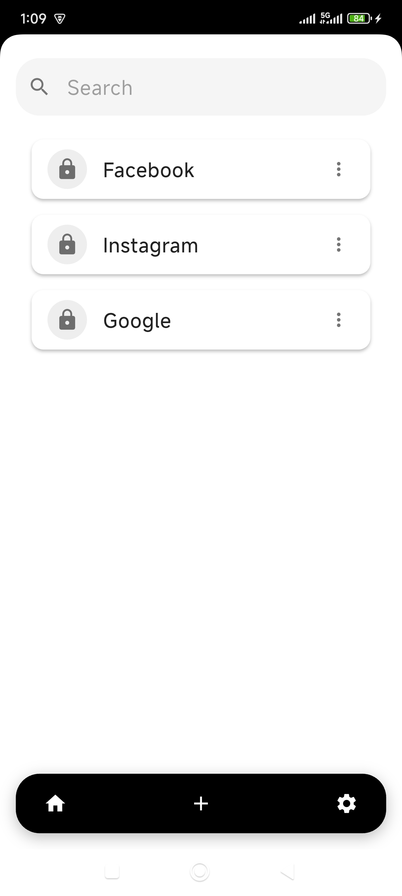
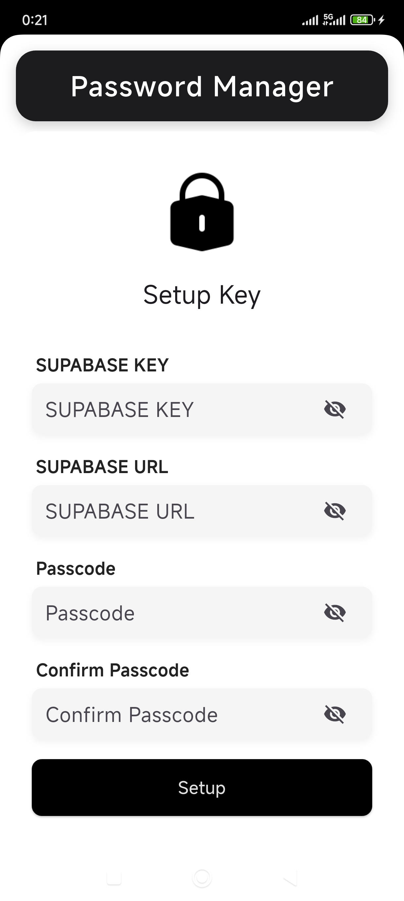
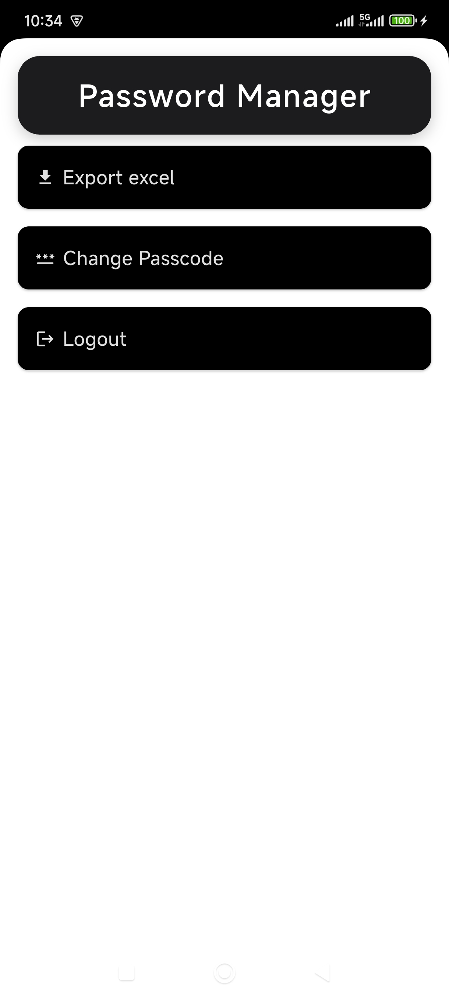
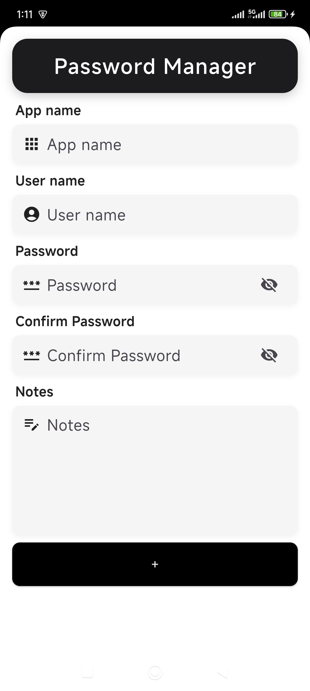

  <h3 align="center" style="color: red;">Password Manager</h3>

  

    🔒A great tool for password🔒
     
  

<!-- ABOUT THE PROJECT -->

## 🔐About The Project

Password Manager is a decentralized password management application built with Flutter and Supabase, designed to give users full control over their own data. Unlike traditional password managers that store data on centralized servers owned by developers, this app follows a user-owned, privacy-first architecture:

-   ✅ Users create their own Supabase project and manually input their project's API URL and Key into the app.

-   ✅ These credentials are stored locally on the user’s device and are never uploaded or saved to any external server.

-   ✅ The app requires users to set up a personal passcode, which is securely stored on the device using flutter_secure_storage. This passcode is also never stored in Supabase.

-   ✅ All data stored in Supabase is AES-encrypted using the user’s passcode as the encryption key, ensuring that only the user can decrypt and access their information.

This approach guarantees maximum privacy, strong security, and full ownership of data, making it an ideal solution for users who care deeply about their digital security and independence.

### Built With

-   

### Demo

    
    
    
    

## Getting Started With Source Code

### Prerequisites

This is small basic tool. You only need

-   [![Visual Studio Code][VisualStudioCodeBadge]][VisualStudioCodeURL]
-   [![Flutter][DartBadge]][DartURL]
-   [![.NET Core][FlutterBadge]][FlutterCoreURL]

[VisualStudioCodeBadge]: https://img.shields.io/badge/IDE-Visual_Studio_Code-0077FF.svg?logo=visual-studio&style=for-the-badge&logo=nextdotjs&logoColor=white&labelColor=fecaca
[VisualStudioCodeURL]: https://code.visualstudio.com/
[DartBadge]: https://img.shields.io/badge/dart-v.3.27.3-0175C2?style=flat&logo=dart&logoColor=%230175C2&logoSize=20&label=Dart&labelColor=%23ffffff&color=%2302569B
[DartURL]: https://dart.dev/docs
[FlutterBadge]: https://img.shields.io/badge/flutter-v.3.27.3-02569B?style=flat&logo=flutter&logoColor=%2302569B&logoSize=20&label=Flutter&labelColor=%23ffffff&color=%2302569B
[FlutterCoreURL]: https://docs.flutter.dev/

### Usage

-   ➡️ Step 1: Create a project on <b>Supabase</b>.

-   ➡️ Step 2: Copy <b>Supabase Url</b> and <b>Supabase Key</b> to config App 

-   ➡️ Step 3: Enter Passcode <b>(Don't forget the Passcode)</b>

