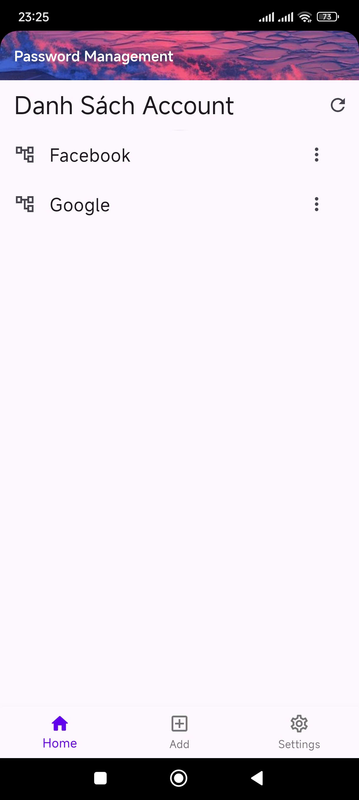
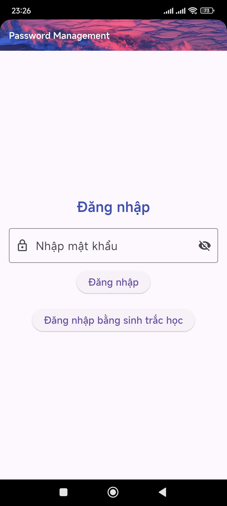
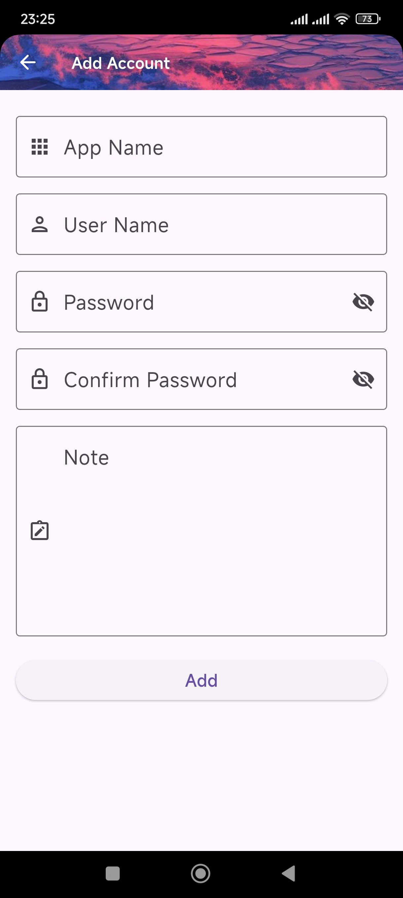
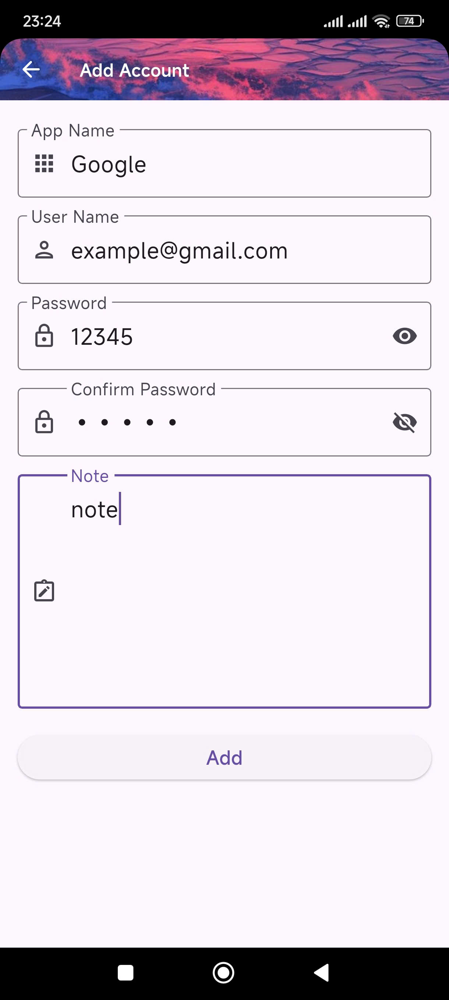
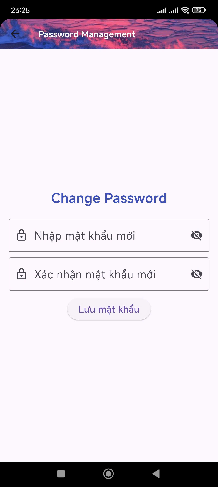

  

  <h3 align="center" style="color: red;">Password Management</h3>

  

    🖼️A great tool for password🖼️
     
    <a href="./password_management/">Source code</a>
  

<!-- TABLE OF CONTENTS -->

  
Table of Contents

  <ol>
    <li>
      <a href="#about-the-project">About The Project</a>
      <ul>
        <li><a href="#built-with">Built With</a></li>
        <li><a href="#demo">Demo</a></li>
      </ul>
    </li>
    <li>
      <a href="#getting-started-with-source-code">Getting Started With Source Code</a>
      <ul>
        <li><a href="#prerequisites">Prerequisites</a></li>
        <li><a href="#usage">Usage</a></li>
      </ul>
    </li>
  </ol>

<!-- ABOUT THE PROJECT -->

## About The Project

Password Manager is a security solution that helps users store and manage login information safely and conveniently. Data is stored on Firestore using the user's personal Google account, ensuring that only the user has access, and the developer cannot view or control this data.

<b>🔒 Maximum security</b>

-   <b>AES Encryption</b>: Logins and passwords are encrypted using the AES algorithm before being stored in Firestore, protecting data from unauthorized access.

-   <b>Secure authentication</b>: The app supports login passwords or biometrics (fingerprint/face) to protect access.

<b>⚡ Main function</b>

-   ✅ Add Account: Store login information securely.

-   ✅ View Account: Easily access a list of saved accounts.

-   ✅ Edit/Delete Account: Update or delete information as needed.

(<a href="#readme-top">back to top</a>)

### Built With

-   

(<a href="#readme-top">back to top</a>)

### Demo

    
    
    
    
    

## Getting Started With Source Code

### Prerequisites

This is small basic tool. You only need

-   [![Visual Studio Code][VisualStudioCodeBadge]][VisualStudioCodeURL]
-   [![Flutter][DartBadge]][DartURL]
-   [![.NET Core][FlutterBadge]][FlutterCoreURL]

[VisualStudioCodeBadge]: https://img.shields.io/badge/IDE-Visual_Studio_Code-0077FF.svg?logo=visual-studio&style=for-the-badge&logo=nextdotjs&logoColor=white&labelColor=fecaca
[VisualStudioCodeURL]: https://code.visualstudio.com/
[DartBadge]: https://img.shields.io/badge/dart-v.3.27.3-0175C2?style=flat&logo=dart&logoColor=%230175C2&logoSize=20&label=Dart&labelColor=%23ffffff&color=%2302569B
[DartURL]: https://dart.dev/docs
[FlutterBadge]: https://img.shields.io/badge/flutter-v.3.27.3-02569B?style=flat&logo=flutter&logoColor=%2302569B&logoSize=20&label=Flutter&labelColor=%23ffffff&color=%2302569B
[FlutterCoreURL]: https://docs.flutter.dev/

### Usage

-   ➡️ Step 1: Go to firebase console and create 1 project.

-   ➡️ Step 2: Add app Android and input package name <b>com.newtun.password_management</b> (importance)

-   ➡️ Step 3: download google-services.json and put it in <b>/password_management/android/app/</b>

-   ➡️ Step 4: in <b>/password_management/lib/services/crypto_service.dart</b>, you must add your new key <b>'256_bits_key'</b> and <b>'128_bits_key'</b>
